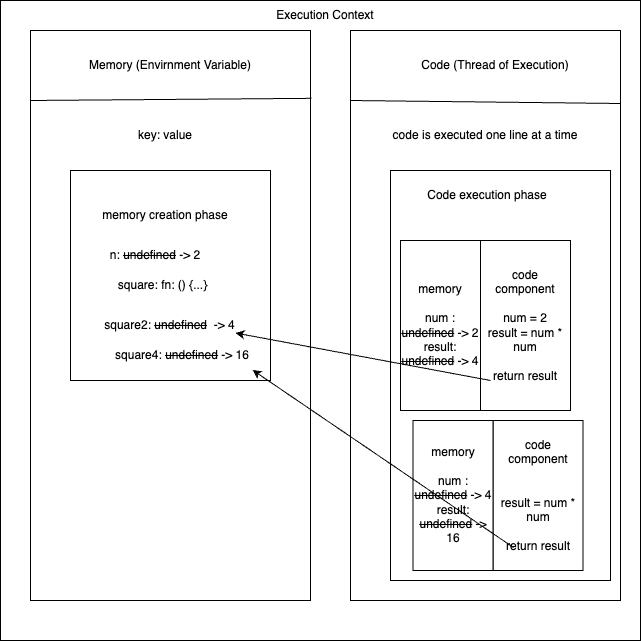
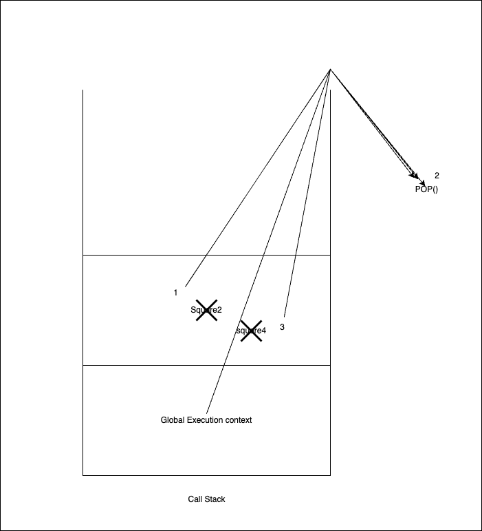

# namaste-javascript

<h2 style="text-align: center">Namaste !!<h2


<h2 style="text-align: center">Javascript !!<h2>

Javascript is a synchronous single-threaded prototype-based scripting langugae.

<details>

<summary>📖 Table of content</summary>
  
<p>

- [`Introduction`](#javascript) - Welcome to Javascript World

- [`CallStack`](#call-stack) - The one where javascript is executed.

</p>

</details>

<br>

# Javascript

- Javascript is a synchronous single-threaded scripting language.

- Javascript can exececute one command at a time in a specific order.

- Everything in javascript happens inside the execution context

| Memory                             | code component                      |
| ---------------------------------- | ----------------------------------- |
| Also known as Variable Environment | Also known as thread of execution   |
| stores data as key: value          | execute the code one line at a time |

```js
// Example to find the square of a number

var n = 2;
function square(num) {
  var result = num * num;
  return result;
}

var square2 = square(2); // 4
var square4 = square(4); // 16
```



# Call Stack

- Call stack maintains the order of execution of the execution context

- this is also known by different name some are following

  - Call stack
  - Execution context stack
  - program stack
  - Runtime stack
  - control stack
  - machine stack



The above example works like

- At the initial phase (when program start) Global execution context is pushed to call stack as the memory-creation phase

- then when code is executed and some block of code (chlid) is come to memory or execution phase the new instance of execution-context is pushed to the call stack which have its own lexical environment with his parent lexical envirnment

> **Note:** lexical environment (child) = lexical exnvironment (parent) + lexical environment (child) or local memory

- in the above code example the `square2` create its own execution context and on return it is `destroyed` or `garbage collected` and similary `square4`

- At last when the program ends so the Global Execution context is also pop out of call stack.
